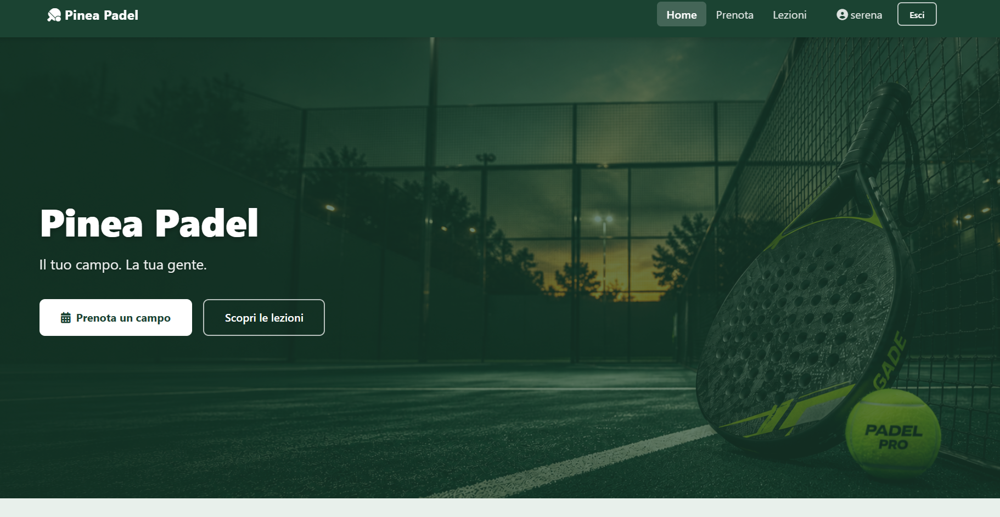
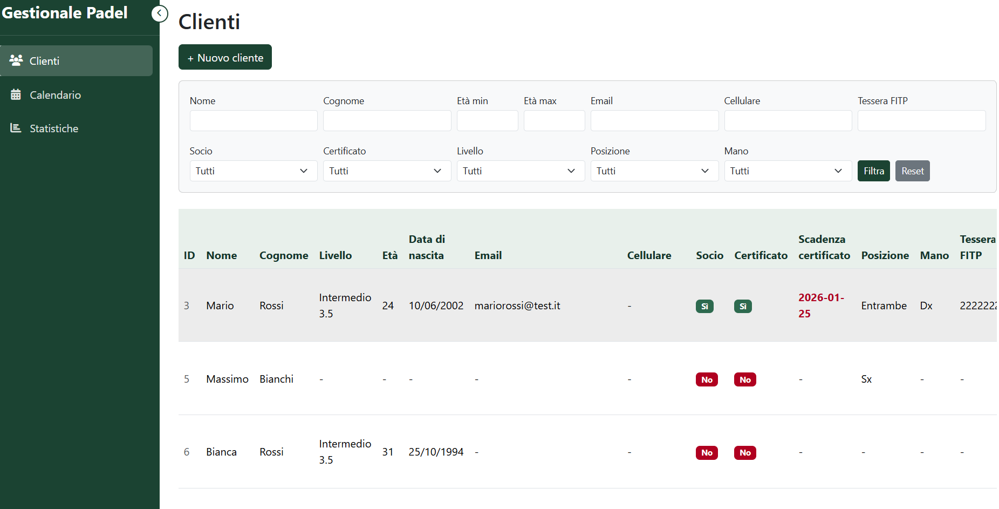
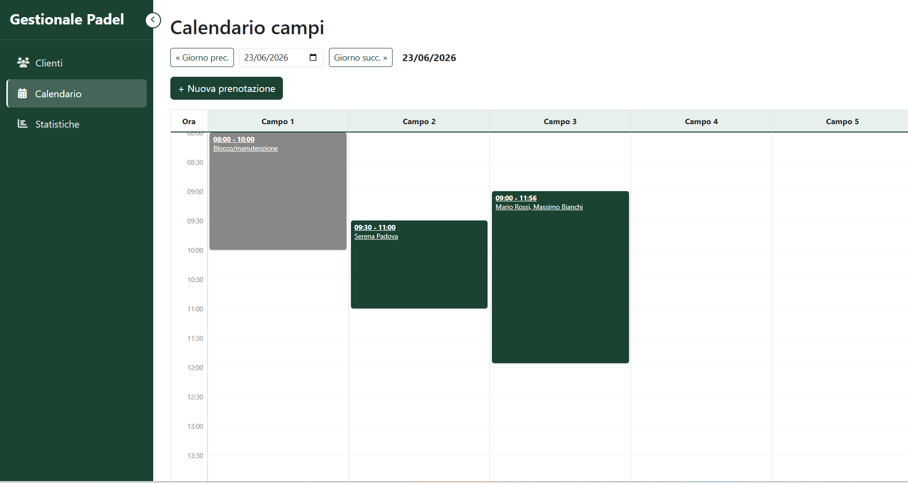
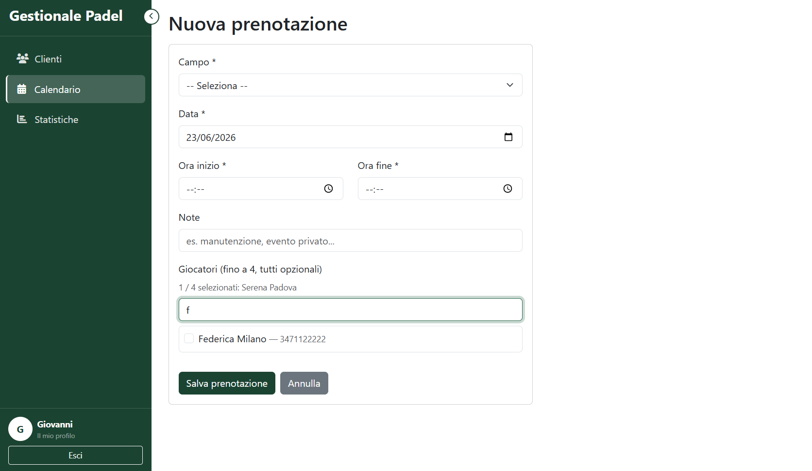
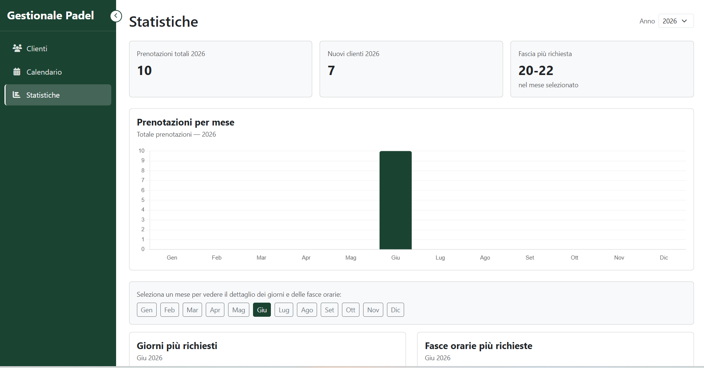
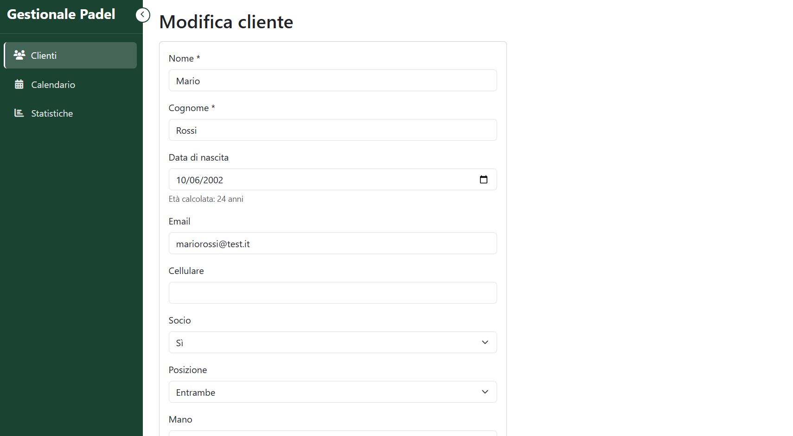

# Pinea Padel — Gestionale

Applicazione web per la gestione interna di un centro sportivo con campi da padel.  
Progetto sviluppato come esercizio pratico full stack con PHP OOP, MySQL e Bootstrap 5.

---

## Funzionalità

**Area pubblica**
- Homepage con presentazione del centro
- Pagina lezioni (corsi disponibili)
- Pagina prenotazione campo (attualmente visiva — vedi [Sviluppi futuri](#sviluppi-futuri))
- Login e registrazione

**Area amministrativa** (accesso riservato agli admin)
- Dashboard con riepilogo generale
- Gestione clienti: creazione, modifica, eliminazione, cambio ruolo
- Gestione prenotazioni: visualizzazione, conferma, eliminazione
- Calendario prenotazioni per campo e fascia oraria
- Statistiche con grafici: prenotazioni per mese, per giorno, fasce orarie più usate, distribuzione livelli FITP, iscrizioni per mese

---

## Stack tecnico

- **PHP 8.2** — OOP, PDO, autoloader personalizzato
- **MySQL** — schema relazionale con chiavi esterne
- **Bootstrap 5** — layout responsive
- **Chart.js** — grafici nelle statistiche
- **Font Awesome** — icone
- **npm** — gestione pacchetti frontend
- **XAMPP** — ambiente di sviluppo locale

---

## Struttura del progetto

```
gestionale_padel/
├── admin/                  # Pagine riservate agli admin
├── classes/                # Classi PHP (Cliente, Prenotazione, Campo, Analytics, Db)
├── config/                 # Configurazione database e BASE_URL
├── helpers/                # Funzioni di autenticazione (requireLogin, requireAdmin...)
├── pages/                  # Pagine dell'area autenticata
├── ui/
│   ├── components/         # Header e footer pubblici
│   └── page/               # Login e registrazione
├── assets/                 # CSS personalizzato
├── img/                    # Immagini
├── sql/                    # Schema del database
├── index.php               # Homepage pubblica
├── prenota.php             # Pagina prenotazione (visiva)
├── lezioni.php             # Pagina lezioni
├── header_dashboard.php    # Header area autenticata
└── footer_dashboard.php    # Footer area autenticata
```

---

## Screenshot

| Homepage | Dashboard |
|---|---|
|  |  |

| Calendario | Nuova prenotazione |
|---|---|
|  |  |

| Statistiche | Modifica cliente |
|---|---|
|  |  |

---

## Installazione locale

**Requisiti:** XAMPP (PHP 8.2+, MySQL), Node.js

```bash
# 1. Clona il repository nella cartella htdocs di XAMPP
git clone <url-repo> gestionale_padel

# 2. Installa i pacchetti frontend
cd gestionale_padel
npm install

# 3. Importa il database
# Apri phpMyAdmin → tab SQL → incolla il contenuto di sql/schema.sql → Esegui

# 4. Controlla BASE_URL in config/config.php
# Se la cartella in htdocs si chiama 'gestionale_padel', lascia invariato.
# Altrimenti aggiorna il valore con il nome corretto.
```

---

## Primo accesso — creazione account admin

Il sistema non include uno script di seed per motivi di sicurezza.  
Per creare il primo utente admin:

1. Vai su `http://localhost/gestionale_padel/ui/page/register.php` e registrati normalmente
2. Apri phpMyAdmin → database `gestionale_padel` → tabella `clienti`
3. Modifica il record appena creato e cambia il campo `ruolo` da `client` ad `admin`
4. Accedi da `ui/page/login.php` — verrai reindirizzato alla dashboard

> Questo passaggio manuale è necessario **solo per il primo admin**.  
> Gli utenti successivi possono ricevere il ruolo admin direttamente dalla dashboard,  
> nella sezione Gestione Clienti, senza passare da phpMyAdmin.

---

## Sviluppi futuri

- **Prenotazione lato cliente**: la pagina `prenota.php` è attualmente solo visiva. L'obiettivo è implementare un calendario interattivo che permetta ai clienti loggati di richiedere una fascia oraria su un campo specifico, con conferma da parte dell'admin e gestione degli slot già occupati.
